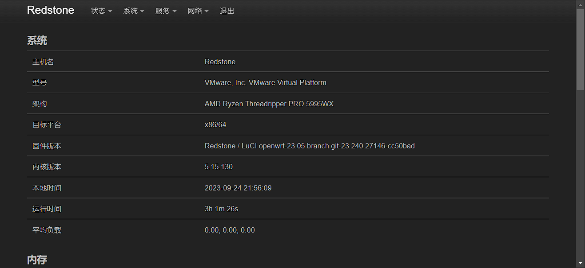

# Redstone | OpenWrt firmware

项目使用 Github Actions 拉取源码仓库进行云编译 OpenWrt

## 固件

下载： [Releases](https://github.com/c3p7f2/build-openwrt/releases)

| 默认 IP     | 默认账号 | 默认密码 |
| ----------- | -------- | -------- |
| 192.168.1.1 | root     | password |

### 分支

<details><summary><b>coolsnowwolf/lede：插件列表及页面预览</b> （点击展开/收起）</summary>


- luci-app-accesscontrol
- luci-app-adguardhome
- luci-app-aliyundrive-webdav
- luci-app-arpbind
- luci-app-autoreboot
- luci-app-cifs-mount
- luci-app-commands
- luci-app-ddns
- luci-app-design-config
- luci-app-diskman
- luci-app-filebrowser
- luci-app-filetransfer
- luci-app-firewall
- luci-app-frpc
- luci-app-ipsec-vpnd
- luci-app-mwan3
- luci-app-n2n
- luci-app-netdata
- luci-app-nfs
- luci-app-nlbwmon
- luci-app-nps
- luci-app-openclash
- luci-app-openvpn
- luci-app-pushbot
- luci-app-qbittorrent
- luci-app-qos
- luci-app-samba4
- luci-app-serverchan
- luci-app-smartdns
- luci-app-softethervpn
- luci-app-ssr-plus
- luci-app-syncdial
- luci-app-ttyd
- luci-app-turboacc
- luci-app-unblockmusic
- luci-app-upnp
- luci-app-usb-printer
- luci-app-vlmcsd
- luci-app-vsftpd
- luci-app-wireguard
- luci-app-wol
- luci-app-xlnetacc
- luci-app-zerotier
- luci-theme-argon
- luci-theme-bootstrap
- luci-theme-design
- luci-theme-material
- luci-theme-netgear

</details>

<details><summary><b>openwrt/openwrt/tree/openwrt-23.05：插件列表及页面预览</b> （点击展开/收起）</summary>



- luci-app-OpenClash

</details>

## 设备

- X86-64
- 斐讯 N1
- Rockchip (Orange-Pi-R1-Plus,Nanopi-R4s,Nanopi-R2s)
- Raspberry Pi (4,3,3b+)
- 虚拟机 (vmdk)
- [Docker 镜像](https://hub.docker.com/r/shashiikora/openwrt-redstone)

## 目录

```
.github\workflows\build-openwrt.yml 编译流程（Action工作流）
                 |docker-image.yml  提交Docker镜像
configs\*\.config                   相应设备配置
       |app.config                  共有插件
scripts\openwrt\add-package.sh      添加软件包
               |init-settings.sh    修改固件信息
               |rewrite.sh          修改固件信息
               |vektor-exec.sh      编译前最后执行的脚本
               |ssh.sh              SSH连接
files\*                             替换文件（源码内）
Dockerfile                          制作Docker镜像
```

## 鸣谢：

- [openwrt/openwrt](https://github.com/openwrt/openwrt)
- [coolsnowwolf/lede](https://github.com/coolsnowwolf/lede)

- [kenzok8/openwrt-packages](https://github.com/kenzok8/openwrt-packages)
- [kenzok8/small](https://github.com/kenzok8/small)
- [ophub/luci-app-amlogic](https://github.com/ophub/luci-app-amlogic)

- [unifreq/openwrt_packit](https://github.com/unifreq/openwrt_packit)
- [ophub/flippy-openwrt-actions](https://github.com/ophub/flippy-openwrt-actions)
- [elgohr/Publish-Docker-Github-Action](https://github.com/elgohr/Publish-Docker-Github-Action)

- [summary/openwrt-aarch64](https://hub.docker.com/r/summary/openwrt-aarch64)
- [haiibo/OpenWrt](https://github.com/haiibo/OpenWrt)
- [bigbugcc/OpenWrts](https://github.com/bigbugcc/OpenWrts)

## License

[MIT](LICENSE) © [MoeOrange]

<hr/>

<div align="right" style=" margin-top:20px">

  

   
   
   <a href="https://badges.toozhao.com/stats/01H9AS9VDKAKXEWV8N076FSJ2Z" target="_blank"></a>
</div>
