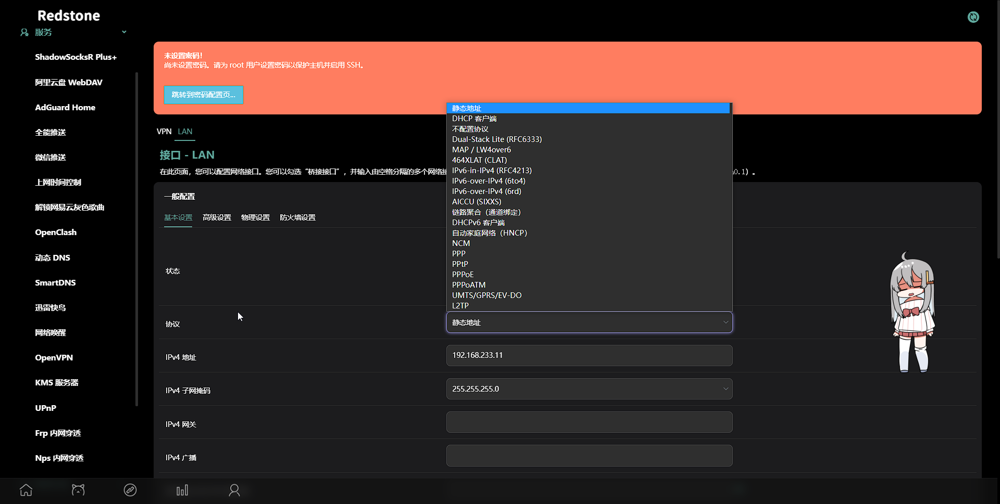

# OpenWrt

一个 OpenWrt 固件仓库，使用 Github Action 自动编译各类实用的[插件](#插件)，生成对应[设备](#设备)的固件。

## 快速开始

1. **下载固件**：固件可在 [Releases](https://github.com/c3p7f2/build-openwrt/releases) 页面下载。

2. **安装固件**：安装 OpenWrt 固件的过程可能因设备而异。通常，你需要了解你设备的型号，以便选择正确的固件。此外，你还需要了解如何刷写新固件。请注意，在安装过程中，你的互联网访问可能会中断几分钟。请确保你已离线拥有所有必需的信息，或者有备用的网络连接来访问互联网。

3. **配置固件**：固件使用的默认 IP 地址是 **192.168.1.1**，默认账号是 **root**，默认密码是 **password**。你可以连接设备来配置后台。

## 插件

<details><summary><b>插件列表及页面预览</b> （点击展开/收起）</summary>


- luci-app-accesscontrol
- luci-app-adguardhome
- luci-app-aliyundrive-webdav
- luci-app-arpbind
- luci-app-autoreboot
- luci-app-cifs-mount
- luci-app-commands
- luci-app-ddns
- luci-app-design-config
- luci-app-diskman
- luci-app-filebrowser
- luci-app-filetransfer
- luci-app-firewall
- luci-app-frpc
- luci-app-ipsec-vpnd
- luci-app-mwan3
- luci-app-n2n
- luci-app-netdata
- luci-app-nfs
- luci-app-nlbwmon
- luci-app-nps
- luci-app-openclash
- luci-app-openvpn
- luci-app-pushbot
- luci-app-qbittorrent
- luci-app-qos
- luci-app-samba4
- luci-app-serverchan
- luci-app-smartdns
- luci-app-softethervpn
- luci-app-ssr-plus
- luci-app-syncdial
- luci-app-ttyd
- luci-app-turboacc
- luci-app-unblockmusic
- luci-app-upnp
- luci-app-usb-printer
- luci-app-vlmcsd
- luci-app-vsftpd
- luci-app-wireguard
- luci-app-wol
- luci-app-xlnetacc
- luci-app-zerotier
- luci-theme-argon
- luci-theme-bootstrap
- luci-theme-design
- luci-theme-material
- luci-theme-netgear

</details>

## 设备

- X86-64
- 斐讯 N1
- Rockchip (Orange-Pi-R1-Plus,Nanopi-R4s,Nanopi-R2s)
- Raspberry Pi (4,3,3b+)
- 虚拟机 (vmdk)
- [Docker 镜像](https://hub.docker.com/r/shashiikora/openwrt-redstone)

## 常见问题解答

**Q: 如何安装固件？**

A: 安装固件的过程可能因设备而异，你可以在视频网站或搜索引擎中查找相应设备的安装教程。

**Q:如何升级固件？**

A: 你可以在我们的 [Releases](https://github.com/c3p7f2/build-openwrt/releases) 页面下载最新版本的固件，然后按照设备文档中的说明刷写新固件。

**Q:支持 DHCPv6 吗？**

A: 支持。

**Q:ext4 和 squashfs 固件有什么区别？**

A: OpenWrt 固件的格式有两种：ext4 和 squashfs。它们的区别主要有两点：  
1、ext4 格式的固件可以扩展磁盘空间大小，而 squashfs 格式的固件不能。  
2、squashfs 格式的固件可以使用重置功能（恢复出厂设置），而 ext4 格式的固件不能。

## 开发

这是**学习**编译 OpenWrt 的项目，很高兴你能看到这里。  
欢迎 一起 以改善垃圾代码。QAQ

```
# 大体目录结构

.github\workflows\build-openwrt.yml 编译流程（Action工作流）
                 |docker-image.yml  提交Docker镜像
configs\*\.config                   相应设备配置
       |app.config                  共有插件
scripts\openwrt\add-package.sh      添加软件包
               |init-settings.sh    修改固件信息
               |rewrite.sh          修改固件信息
files\*                             替换文件（源码内）
Dockerfile                          制作Docker镜像
...                                 ...
```

## 鸣谢：

源码：

- [openwrt/openwrt](https://github.com/openwrt/openwrt)
- [coolsnowwolf/lede](https://github.com/coolsnowwolf/lede)

软件包：

- [kenzok8/openwrt-packages](https://github.com/kenzok8/openwrt-packages)
- [kenzok8/small](https://github.com/kenzok8/small)
- [ophub/luci-app-amlogic](https://github.com/ophub/luci-app-amlogic)

打包：

- [unifreq/openwrt_packit](https://github.com/unifreq/openwrt_packit)
- [ophub/flippy-openwrt-actions](https://github.com/ophub/flippy-openwrt-actions)
- [elgohr/Publish-Docker-Github-Action](https://github.com/elgohr/Publish-Docker-Github-Action)

学习：

- [summary/openwrt-aarch64](https://hub.docker.com/r/summary/openwrt-aarch64)
- [haiibo/OpenWrt](https://github.com/haiibo/OpenWrt)
- [bigbugcc/OpenWrts](https://github.com/bigbugcc/OpenWrts)

## 许可证

本项目采用[MIT 许可证](LICENSE)。

<hr/>

<div align="right" style=" margin-top:20px">
  

   
</div>
