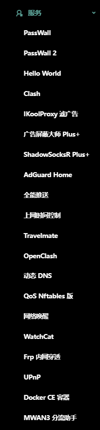

  

 

> 一个在外观和功能上平衡的 OpenWrt 固件

 

 

| 默认登陆 IP | 默认账号 | 默认密码 |
| ----------- | -------- | -------- |
| 192.168.1.1 | root     | password |

| 设备                                       |
| ------------------------------------------ |
| x86                                        |
| VMware、Esxi（需下载拓展名为 vmdk 的固件） |

### [--> 下载固件](https://github.com/c3p7f2/build-openwrt/releases/tag/Redstone)

