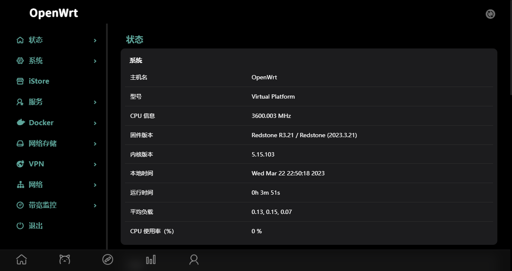

  

> 一个在UI外观和功能上平衡的OpenWrt固件

| 默认登陆 IP | 默认账号 | 默认密码 |
| ----------- | -------- | -------- |
| 192.168.1.1 | root     | password |

| 设备          |
| ------------- |
| x86  同时支持x86平台下的VMware、Esxi，需下载拓展名为vmdk的固件    |
| 斐讯N1     |
| xiaomi-cr660x |
| redmi-ax6     |

### [--> 下载固件](https://github.com/c3p7f2/build-openwrt/releases/tag/Redstone)

